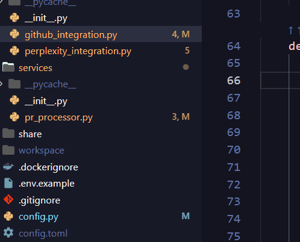

# VERTEX - Python Code Analysis (Beta)

 🚀 Real-time cross-file Python analysis with visual highlighting and dead code detection

## ⚠️ Beta Software Notice

VERTEX is currently in **beta**. While fully functional, you may encounter minor issues. Please report bugs and share feedback to help improve the extension!

## ✨ What Makes VERTEX Unique

- **🎯 Real-time cross-file analysis** - Understands your entire Python project
- **🎨 Visual code highlighting** - See caller/callee relationships directly in your editor
- **⚡ Interactive navigation** - Lock on functions and navigate with keyboard shortcuts
- **💀 Smart dead code detection** - Find unused functions across your entire project
- **📊 Inline statistics** - See caller/callee counts above each function

## 🚀 Quick Start

### Installation Options:

**Option 1: VS Code Marketplace (Recommended)**
1. Open VS Code
2. Go to Extensions (Ctrl+Shift+X)
3. Search for "VERTEX"
4. Click Install

**Option 2: Direct Download**
1. Download from [GitHub Releases](https://github.com/i-ayushh18/Vertex/releases)
2. Install via: `code --install-extension vertex-extension-0.1.0.vsix`

### Usage:
1. **Open** any Python project
2. **See CodeLens** appear above your functions showing caller/callee counts
3. **Click CodeLens** to lock highlighting on a function
4. **Use `Alt+]` and `Alt+[`** to navigate between callers

## 🎯 Key Features

### Visual Code Relationships
*See how your code connects across the entire project.*

- **Orange highlights**: Lines that call your current function
- **Pink highlights**: Functions called by your current function
- **Real-time updates** as you navigate through code

### Dead Code Detection
*Find and remove unused functions with project-wide confidence.*

- **Cross-file intelligence** knows if functions are called from other files
- **Smart exclusions** for entry points and special methods

### Interactive Navigation
- **Lock mode**: Focus on one function's relationships
- **Keyboard shortcuts**: Navigate quickly between related code
- **Cross-file navigation**: Jump between files seamlessly

## ⌨️ Keyboard Shortcuts

- `Alt+]` - Navigate to next caller
- `Alt+[` - Navigate to previous caller
- `Esc` - Exit navigation mode

## 🛠️ Commands

- `VERTEX: Analyze Dead Code` - Run project-wide dead code analysis
- `VERTEX: Test Backend Connection` - Check if analysis server is running

## ⚙️ Configuration

Customize VERTEX through VS Code settings:

- `vertex.showCallerHighlights` - Show orange caller highlights
- `vertex.showCalleeHighlights` - Show pink callee highlights
- `vertex.showCodeLens` - Show inline statistics above functions
- `vertex.showUnusedWarnings` - Show dead code warnings
- `vertex.exclude` - File patterns to exclude from analysis

## 🐛 Known Limitations (Beta)

- Large projects (500+ files) may experience slower analysis
- Some complex import patterns might not be fully resolved
- Occasional file collection timing issues

## 📞 Support & Feedback

- **Questions**: Open an issue with the "question" label

## 📄 License

MIT License - see [LICENSE](LICENSE) file for details.

---

**Made with ❤️ for the Python community**